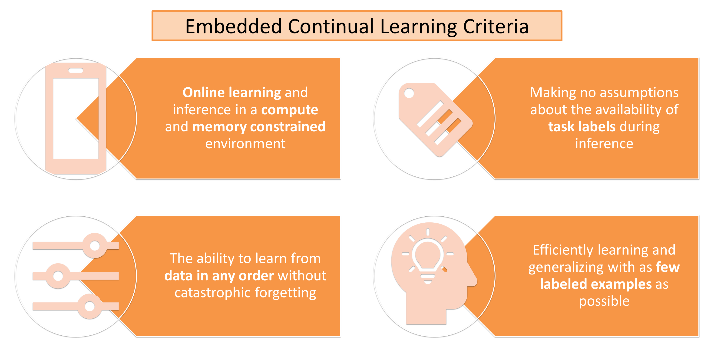
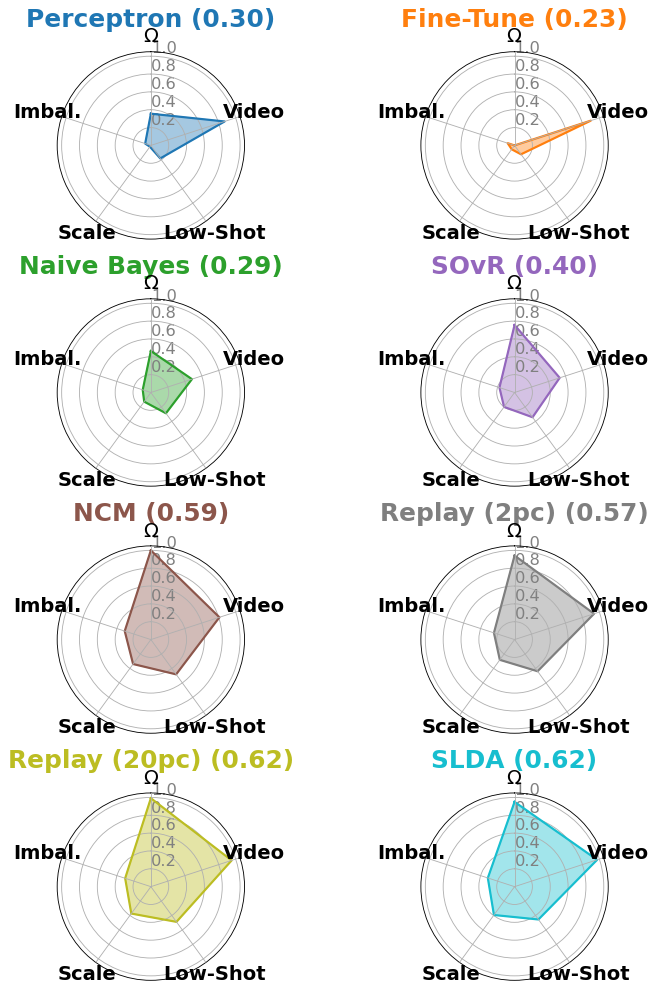

Online Continual Learning for Embedded Devices
=====================================
This is PyTorch code for our CoLLAs 2022 paper available on [arXiv](https://arxiv.org/abs/2203.10681). A video of our
paper is available on [YouTube](https://youtu.be/jZgIxzEuNv4).

**Abstract:** Real-time on-device continual learning is needed for new applications such as home robots, user
personalization on smartphones, and augmented/virtual reality headsets. However, this setting poses
unique challenges: embedded devices have limited memory and compute capacity and conventional
machine learning models suffer from catastrophic forgetting when updated on non-stationary data
streams. While several online continual learning models have been developed, their effectiveness
for embedded applications has not been rigorously studied. In this paper, we first identify criteria
that online continual learners must meet to effectively perform real-time, on-device learning. We
then study the efficacy of several online continual learning methods when used with mobile neural
networks. We measure their performance, memory usage, compute requirements, and ability to
generalize to out-of-domain inputs.



## Dependencies

We have tested the code with the following packages and versions:

- Python 3.7.7
- torch (GPU) 1.10.1
- torchvision 0.11.2
- torchsummary 1.5.1
- numpy 1.18.0
- scikit_learn 1.1.1
- Pillow 9.2.0
- h5py 2.10.0
- cuda toolkit 11.3
- NVIDIA GPU

We recommend setting up a `conda` environment with these same package versions:

```
conda create -n embedded_cl python=3.7.7
conda activate embedded_cl
conda install -c anaconda pillow
conda install numpy
pip install scikit-learn
conda install -c anaconda h5py
pip install tensorboard
pip install setuptools==59.5.0 # this is to fix a bug with tensorboard
conda install pytorch==1.10.1 torchvision==0.11.2 torchaudio==0.10.1 cudatoolkit=11.3 -c pytorch -c conda-forge
```

## Setup Datasets

We download and extract each of the following datasets and their associated files into one main folder per dataset.

- [Places-365](http://places2.csail.mit.edu/index.html) [[1]](#1)
    - Download and extract the 256x256 standard version of the Places-365 dataset. We train on the `train` partition
      and evaluate on the `val` partition: http://places2.csail.mit.edu/download.html

- [Places-Long-Tail (Places-LT)](https://liuziwei7.github.io/projects/LongTail.html) [[2]](#2)
    - Download and extract the Places-LT dataset and associated text files. Note that the prefix directories in the
      Places-LT text files must match the directories where you downloaded the Places-365 images. For
      example, the first line of `Places_LT_train.txt` contains the root `data_256/a/airfield/` but this needed to be
      changed to `train/airfield/` based on how I extracted Places-365 from the step above. This naming is crucial for
      the feature extraction step below. We train on the `train` partition and evaluate on the `val` partition:
      https://drive.google.com/drive/folders/1NmlP2oXSR5aCAuMjrId5e0c25H_PuEQf

- [OpenLORIS](https://lifelong-robotic-vision.github.io/dataset/object) [[3]](#3)
    - We use the ICRA-2020 version of the OpenLORIS object dataset. Download and extract `train.zip` and `test.zip` from
      the `OpenLORIS_Object_ICRA2020` section of this Google Doc (see pages 4-5):
      https://docs.google.com/document/d/1KlgjTIsMD5QRjmJhLxK4tSHIr0wo9U6XI5PuF8JDJCo/edit

- [FSIOL-310](https://arxiv.org/abs/2103.12242) [[4]](#4)
    - Download and extract the FSIOL-310 dataset. We use this dataset in 5-shot and 10-shot settings. For these
      settings, our scripts randomly select 5 or 10 images from each class to be used as training data respectively, and
      the remaining images from each class are used for
      testing: https://drive.google.com/file/d/1nYAJt5eiJy6jc5DvqbIkzu_oFoJCUyjW/view

### Extract Places Features

To reduce compute time for large-scale experiments, we pre-extract and save features from each backbone CNN for the
Places-365 and Places-LT datasets. We provide the Python file [cache_features.py](cache_features.py) and associated
bash script [cache_places_features.sh](./scripts/cache_places_features.sh) to do this. In the bash script, set the
appropriate directory to the Places-365 dataset (`DATASET_PATH`) and provide a directory to save the features out as h5
files (`CACHE_PATH`). Once the paths are set, run the bash script to save the features. Saving features for all five
backbones requires 34 GB for Places-365 and 1.8 GB for Places-LT.

## Train Models

Our repo contains the following main directories:

- [models](./models): contains model classes for each online continual learner
- [openloris](./openloris): contains dataset classes and scripts to run experiments on OpenLORIS and FSIOL
- [scripts](./scripts): contains bash scripts to reproduce our experimental results

We provide two main experiment scripts:

- [streaming_places_experiment.py](./streaming_places_experiment.py) is used to run experiments on Places-365 and
  Places-LT
- [full_streaming_experiment.py](./openloris/full_streaming_experiment.py) is used to run experiments on OpenLORIS and
  FSIOL

More specifically, in the folder [scripts](./scripts), we provide bash scripts to run each main experiment as follows:

- [run_places_experiments.sh](./scripts/run_places_experiments.sh)
    - Trains each online continual learner on the `iid` and `class-iid` ordering of the `Places-365` dataset with each
      of the five backbone CNNs. Trains all models on a single data order permutation.
- [run_places_lt_experiments.sh](./scripts/run_places_lt_experiments.sh)
    - Trains each online continual learner on the `iid` and `class-iid` ordering of the `Places-LT` dataset with each of
      the five backbone CNNs. Trains all models on three data order permutations.
- [run_open_loris_instance_experiments.sh](./scripts/run_open_loris_instance_experiments.sh)
    - Trains each online continual learner on the `instance` ordering of the `OpenLORIS` dataset with each of
      the five backbone CNNs. Trains all models on three data order permutations.
- [run_open_loris_low_shot_instance_experiments.sh](./scripts/run_open_loris_low_shot_instance_experiments.sh)
    - Trains each online continual learner on the `low-shot instance` ordering of the `OpenLORIS` dataset with each of
      the five backbone CNNs. Trains all models on three data order permutations.
- [run_fsiol_experiments.sh](./scripts/run_fsiol_experiments.sh)
    - Trains each online continual learner on the `5-shot` and `10-shot` scenarios of the `FSIOL` dataset with each of
      the five backbone CNNs. Trains all models on three data order permutations.

For each bash script, set the appropriate path to the respective dataset images (`IMAGES_DIR`), extracted features
(`FEATURES_DIR`), or results folder (`SAVE_DIR`).

## Evaluate Models

During training, our scripts save out the following results for each model:

- Final model checkpoint (`model_weights_final.pth`)
- Incremental performances for Places-365 and Places-LT (`accuracies_min_trained_0_max_trained_365.json`)
- Incremental performances for OpenLORIS and FSIOL (`accuracies_index_-1.json`)

To evaluate the performance for each experiment, we provide the following scripts:

- [analyze_results_places.py](./analyze_results_places.py)
    - Evaluates the final results of each online learner using the `iid` and `class-iid` orderings of the `Places-365`
      and `Places-LT` datasets. Results are provided for each backbone CNN and averaged across data orderings.
- [analyze_results_openloris.py](./analyze_results_openloris.py)
    - Evaluates the final results of each online learner using the `instance` and `low-shot instance` orderings of the
      `OpenLORIS` dataset. Results are provided for each backbone CNN and averaged across data orderings. This script
      also plots a bar chart comparing performance on the `instance` and `low-shot instance` orderings. This script also
      plots learning curves for the `low-shot instance` ordering for each backbone CNN.
- [analyze_results_fsiol.py](./analyze_results_fsiol.py)
    - Evaluates the final results of each online learner using the `5-shot` and `10-shot` scenarios of the `FSIOL`
      dataset. Results are provided for each backbone CNN and averaged across data orderings.

For each script, set the appropriate path to the results files (`results_dir`) and provide a path to save plots
(`save_dir`) in the `main` function.

## Results

### Spider Plots Summarizing Overall Results

We evaluate the performance of each learner across five axes: NetScore (**Ω**), ability to learn from **Videos**,
ability to learn in **Low-Shot** settings, ability to **Scale**, and ability to learn from **Imbalanced** data streams.
We found **SLDA**, **Replay**, and **NCM** performed the best across experiments. The **EfficientNet-B1** backbone
yielded the best performance across experiments.



## References

<a id="1">[1]</a> Zhou, B., Lapedriza, A., Khosla, A., Oliva, A., & Torralba, A. (2017). Places: A 10 million image
database for scene recognition. TPAMI.

<a id="2">[2]</a> Liu, Z., Miao, Z., Zhan, X., Wang, J., Gong, B., & Yu, S. X. (2019). Large-scale long-tailed
recognition in an open world. CVPR.

<a id="2">[3]</a> She, Q., Feng, F., Hao, X., Yang, Q., Lan, C., Lomonaco, V., Shi, X., Wang, Z., Guo, Y., Zhang, Y.,
Qiao, F., & Chan, R. H. (2020). OpenLORIS-Object: A robotic vision dataset and benchmark for lifelong deep learning.
ICRA.

<a id="2">[4]</a> Ayub, A., & Wagner, A. R. (2021). F-SIOL-310: A Robotic Dataset and Benchmark for Few-Shot Incremental
Object Learning. ICRA.

## Citation

If using this code, please cite our paper.

```
@InProceedings{Hayes_2022_Embedded_CL,
    author = {Hayes, Tyler L. and Kanan, Christopher},
    title = {Online Continual Learning for Embedded Devices},
    booktitle = {Conference on Lifelong Learning Agents (CoLLAs)},
    month = {August},
    year = {2022}
}
